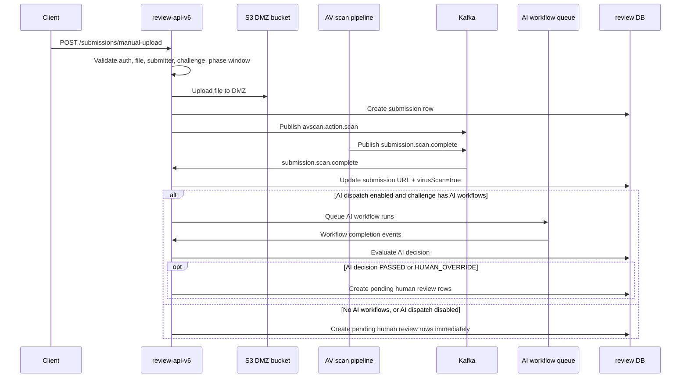

# Manual Upload Flow

## Purpose

`POST /submissions/manual-upload` exists so an admin or M2M client can upload a submission artifact after the normal submission window has already closed, while the challenge is already in a review-related phase.

The important point is that this endpoint does not create a special review path. It uploads the file to the DMZ bucket, then delegates into the normal submission creation, antivirus scan, and downstream review-processing flow.

## Request Contract

The endpoint accepts `multipart/form-data`.

Required fields:

- `file`
- `challengeId`
- `memberId`
- `type`

Optional fields:

- `memberHandle`
- `fileName`
- `legacySubmissionId`
- `legacyUploadId`
- `submissionPhaseId`
- `submittedDate`

Auth rules:

- The controller requires `create:submission`.
- The service only allows admin users or M2M tokens. Regular member tokens are rejected.

## High-Level Flow

## Detailed Flow

### 1. Manual-upload specific validation

Before the submission row is created, the service verifies:

- The caller is admin-capable.
- A file body is actually present.
- If `memberHandle` is supplied, that handle must match a submitter resource on the challenge and the supplied `memberId`.

### 2. Upload to the DMZ bucket

The uploaded file is stored in `SUBMISSION_DMZ_S3_BUCKET`.

Behavior:

- The requested filename is sanitized.
- If it has no extension, one is derived from MIME type when possible.
- The object key is written under:

`manual/{challengeId}/{memberId}/{uuid}-{safeFileName}`

The resulting S3 HTTP URL becomes the submission URL passed into normal submission creation.

### 3. Delegate into normal submission creation

After the DMZ upload succeeds, the endpoint calls the standard `createSubmission(...)` path with a privileged flag.

That means the manual upload still gets the same core checks as a normal submission:

- challenge exists
- member is registered as a submitter
- submission type is allowed for the challenge
- Final Fix submissions are still limited to winners

The only difference is phase validation.

### 4. Privileged phase window rules

Manual upload is only allowed when:

- `Submission` / `Topgear Submission` is already closed
- a review-related target phase is currently open

Allowed open phases by submission type:

| Submission type | Required open phase |
| --- | --- |
| `CHECKPOINT_SUBMISSION` | `Checkpoint Screening` or `Checkpoint Review` |
| Everything else | `Screening`, `Review`, `Iterative Review`, or `Approval` |

So this endpoint is intentionally for late/manual intake during downstream review, not for bypassing the normal live submission window.

### 5. Submission row creation

The created submission row is initially stored with:

- `status = ACTIVE`
- `virusScan = false`
- `eventRaised = false`
- `url = <DMZ URL>`

At this point the file is not yet considered clean.

### 6. Events emitted immediately after creation

For file-based manual uploads, `review-api-v6` publishes:

- `avscan.action.scan`
- `submission.notification.create`

It also increments challenge submission counters.

The AV scan event includes:

- submission id
- current URL
- file name
- clean destination bucket
- quarantine destination bucket
- callback topic `submission.scan.complete`

## What Happens After AV Scan

When `submission.scan.complete` is received:

- If the file is infected, processing stops.
- If the file is clean, the submission row is updated with:
  - the scanned/clean URL
  - `virusScan = true`

From there the flow splits.

### Path A: no AI workflow dispatch

Pending human review rows are created immediately when either of these is true:

- `DISPATCH_AI_REVIEW_WORKFLOWS` is not `true`
- the challenge has no configured AI workflows

In that mode, a manual upload behaves like a normal scanned submission and enters human review creation directly.

### Path B: AI workflow dispatch enabled

If both are true:

- `DISPATCH_AI_REVIEW_WORKFLOWS=true`
- the challenge has AI workflows configured

then the scan-complete handler queues AI workflow runs and intentionally does **not** create pending human review rows yet.

The challenge AI workflows are loaded from challenge reviewer configuration where `isMemberReview = false`.

## How Human Review Creation Waits on AI

As AI workflows complete:

1. workflow run records are updated
2. the AI decision maker evaluates the submission against the latest `aiReviewConfig` for the challenge
3. pending human review rows are created only when the AI decision is:
   - `PASSED`
   - `HUMAN_OVERRIDE`

If the AI decision is failed, human review rows are not auto-created by this path.

## What "AI Reviews Will Be Handled" Means Here

For a manually uploaded submission, AI handling works correctly when all of the following are true:

1. the file passes antivirus scanning
2. `DISPATCH_AI_REVIEW_WORKFLOWS=true`
3. `PGBOSS_DATABASE_URL` is configured so the queue worker can run
4. the challenge has AI workflows configured
5. the challenge also has a valid active `aiReviewConfig`

When those conditions hold, a manual upload enters the same AI workflow dispatch path as any other scanned file submission.

## Important Caveats

### AI is skipped entirely when dispatch is disabled

If `DISPATCH_AI_REVIEW_WORKFLOWS` is not `true`, manual uploads do not run AI workflows. They go straight to human pending reviews after scan completion.

### Challenge AI workflows without `aiReviewConfig` are risky

Current behavior has an important gap:

- the scan-complete handler skips pending human review creation when AI workflows exist
- later, the AI decision maker requires an active `aiReviewConfig`
- if no active `aiReviewConfig` exists, decision evaluation returns `null`
- in that case, this code path does not create pending human review rows

So a challenge with AI workflows configured but no active AI review config can leave a manually uploaded submission without the expected human review rows.

### Infected files stop the flow

If the AV scan marks the file as infected, the submission does not continue into AI or human review creation.
